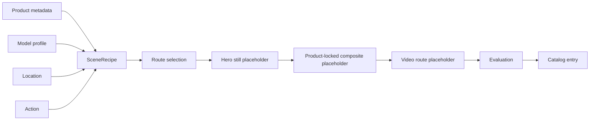

# LuxFlow AI

LuxFlow AI is a local-first workflow studio for product-preserving generative catalog videos. It turns static luxury handbag assets into short cinematic catalog clips through declarative scene recipes, engine-agnostic routing, product-locked compositing, stage-aware caching, and lightweight evaluation.

Actual model execution is intentionally deferred to later implementation passes. This repository foundation documents the architecture, contracts, UI, and stub pipeline paths without downloading weights, installing ComfyUI, or calling paid APIs.

## What This Project Is

LuxFlow AI is a portfolio-grade AI architecture repo for handbag catalog workflows. It shows how product metadata, model profiles, locations, and actions can compile into deterministic scene recipes and route through multiple future generation engines.

## What This Project Is Not

It is not a full SaaS product, not a model-execution build, not an apparel try-on system, and not a Gradio or Streamlit demo. It does not include auth, Celery, Redis, Docker, real video generation, or user accounts.

## Why Handbag-First

Handbags are visually rich, commercially relevant, and easier to preserve than apparel fit. The MVP targets 8-12 curated catalog entries, not a full combinatorial matrix.

## Architecture Overview




## MVP Scope

The MVP includes handbag metadata, synthetic or licensed model profiles, declarative recipes, stubbed routes for Diffusers, ComfyUI, and LTX, product preservation contracts, a React workflow inspector, and two evaluation metrics: prompt adherence and product preservation.

## Tech Stack

- React, Vite, and TypeScript for the UI.
- FastAPI and Pydantic for backend contracts.
- SQLite/local JSON metadata for early persistence.
- Optional future extras for Diffusers, ComfyUI, LTX, and MoviePy/ffmpeg.

## Repository Structure

- `backend/app/`: FastAPI app, contracts, registry, compiler, router, pipeline stubs.
- `frontend/`: React/Vite workflow studio UI.
- `assets/`: sample handbag, model, location, action, and catalog metadata.
- `docs/`: architecture, scope, execution notes, evaluation, and ADRs.
- `scripts/`: seed, placeholder generation, and benchmark helpers.
- `workflows/`: future Diffusers and ComfyUI workflow notes.

## Run Backend

```bash
cd luxflow-ai
python -m venv .venv
source .venv/bin/activate
pip install -e ".[dev]"
make backend
```

Backend runs at `http://127.0.0.1:8000`.

## Run Frontend

```bash
cd luxflow-ai/frontend
npm install
npm run dev
```

Set `VITE_API_BASE_URL=http://127.0.0.1:8000` if needed.

## Example Scene Recipe

```json
{
  "product_id": "black_structured_bag",
  "model_id": "adult_female_editorial_01",
  "location_id": "hotel_lobby",
  "action_id": "walking_with_bag",
  "seed": 42,
  "aspect_ratio": "9:16",
  "mode": "preview"
}
```

## Evaluation Strategy

Evaluation is intentionally lightweight: prompt adherence checks whether scene intent was followed, and product preservation checks whether the handbag remains recognizable. Scores are placeholders until real outputs exist.

## Synthetic Identity Provenance

Demo model identities should be synthetic, licensed, or anonymous. The MVP must not use celebrities, real-person impersonation, or customer-uploaded portraits.

## Current Limitations

Generation is stubbed, videos are placeholders, benchmarking is planned-route comparison only, and product lock validation returns explanatory notes rather than image analysis.

## Future Work

Future passes can add real hero-still generation, product freeze masks, ComfyUI workflow import, LTX image-to-video, hosted fallback routing, product-locked projection, richer evaluation, and a curated README demo.
