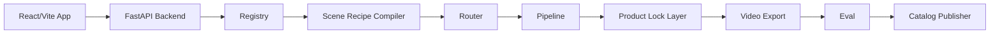
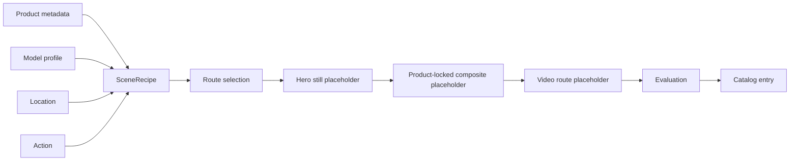

# LuxFlow AI

LuxFlow AI is a local-first workflow studio for product-preserving generative catalog videos. It turns static luxury handbag assets into short cinematic catalog clips through declarative scene recipes, engine-agnostic routing, product-locked compositing, stage-aware caching, and lightweight evaluation.

Actual model execution is intentionally deferred to later implementation passes. This repository foundation documents the architecture, contracts, UI, and stub pipeline paths without downloading weights, installing ComfyUI, or calling paid APIs.

## Current Implementation Status

- ✅ contracts
- ✅ registry
- ✅ recipe compiler
- ✅ router
- ✅ placeholder artifact pipeline
- ✅ product-lock placeholder
- ✅ frontend workflow preview
- ✅ optional Diffusers hero-still route with placeholder fallback
- ✅ real SDXL hero-still smoke path on MPS
- ✅ hero-stage action prompts separated from final catalog action labels
- ✅ prompt tuning contact-sheet script
- ⏳ product-locked composite v1 with real source product imagery
- ⏳ real LTX video route
- ⏳ ComfyUI visual route

## What This Project Is

LuxFlow AI is a portfolio-grade AI architecture repo for handbag catalog workflows. It shows how product metadata, model profiles, locations, and actions can compile into deterministic scene recipes and route through multiple future generation engines.

## What This Project Is Not

It is not a full SaaS product, not a model-execution build, not an apparel try-on system, and not a Gradio or Streamlit demo. It does not include auth, Celery, Redis, Docker, real video generation, or user accounts.

## Why Handbag-First

Handbags are visually rich, commercially relevant, and easier to preserve than apparel fit. The MVP targets 8-12 curated catalog entries, not a full combinatorial matrix.

## Architecture Overview





## MVP Scope

The MVP includes handbag metadata, synthetic or licensed model profiles, declarative recipes, stubbed routes for Diffusers, ComfyUI, and LTX, product preservation contracts, a React workflow inspector, and two evaluation metrics: prompt adherence and product preservation.

## Tech Stack

- React, Vite, and TypeScript for the UI.
- FastAPI and Pydantic for backend contracts.
- SQLite/local JSON metadata for early persistence.
- Optional future extras for Diffusers, ComfyUI, LTX, and MoviePy/ffmpeg.

## Repository Structure

- `backend/app/`: FastAPI app, contracts, registry, compiler, router, pipeline stubs.
- `frontend/`: React/Vite workflow studio UI.
- `assets/`: sample handbag, model, location, action, and catalog metadata.
- `docs/`: architecture, scope, execution notes, evaluation, and ADRs.
- `scripts/`: seed, placeholder generation, and benchmark helpers.
- `workflows/`: future Diffusers and ComfyUI workflow notes.

Key docs:

- `docs/current_status.md`: implemented vs. deferred capabilities.
- `docs/pipeline.md`: current placeholder artifact lifecycle.
- `docs/product_preservation.md`: product-lock placeholder policy.
- `docs/local_execution.md`: local setup and execution notes.
- `docs/model_access.md`: model access, license notes, and probe workflow.
- `docs/model_probe_results.md`: observed local model probe results.
- `docs/hero_still_review_checklist.md`: manual review checklist for prompt tuning.
- `docs/prompt_tuning_results.md`: latest prompt variant contact-sheet run.

## Run Backend

```bash
cd luxflow-ai
python3 -m venv .venv
source .venv/bin/activate
pip install -e ".[dev]"
make backend
```

Backend runs at `http://127.0.0.1:8000`.

## Run Tests and Lint

```bash
cd luxflow-ai
make test
make lint
```

`make test` runs the backend pytest suite. `make lint` runs Ruff for backend/scripts and TypeScript checks for the frontend.

## Run Frontend

```bash
cd luxflow-ai/frontend
npm install
npm run dev
```

Set `VITE_API_BASE_URL=http://localhost:8000` in `frontend/.env` if needed.

## Run the Golden Demo

The canonical demo request is stored at `assets/demo/golden_recipe.json`.
For real hero-still generation, prefer `assets/demo/golden_empty_hand_recipe.json`;
it keeps the final catalog goal but asks the image model for an empty-hand scene canvas.

Start the backend:

```bash
cd luxflow-ai
make backend
```

Start the frontend:

```bash
cd luxflow-ai/frontend
npm run dev
```

In Workflow Mode, use `Load Golden Demo` to populate the form and `Run Golden Demo` to create artifacts.

Run from CLI:

```bash
cd luxflow-ai
python scripts/run_golden_demo.py
```

Run the empty-hand hero-still recipe:

```bash
python scripts/run_golden_demo.py --recipe-file assets/demo/golden_empty_hand_recipe.json
```

Run through the API:

```bash
curl http://127.0.0.1:8000/demo/golden-recipe
curl -X POST http://127.0.0.1:8000/demo/run-golden
```

The demo creates deterministic local artifacts under `assets/outputs/{request_hash}/` and serves them through `/static/assets/outputs/{request_hash}/...`. It does not run ML or generate a real video.

## Optional Real Hero-Still Generation

Default install keeps heavy ML dependencies out:

```bash
pip install -e ".[dev]"
```

Optional generation install:

```bash
pip install -e ".[dev,generation]"
```

Run the placeholder golden demo:

```bash
make demo
```

Attempt one real Diffusers hero still:

```bash
LUXFLOW_ENABLE_REAL_IMAGE_GENERATION=true python scripts/run_golden_demo.py
```

or:

```bash
python scripts/run_golden_demo.py --real-image
```

The first real run may download model weights and may require accepting model access terms. Local performance depends on hardware. The generated hero still should create the adult model, scene, and action context; it should not attempt to generate the exact handbag. Handbag fidelity remains handled by the product-lock/composite stage.

## Real Hero-Still Validation

Observed on this repository pass:

- Optional dependencies installed: `torch 2.12.0`, `diffusers 0.38.0`, `transformers 5.8.1`.
- `/system/capabilities` reports generation dependencies when installed and keeps real generation disabled by default.
- An unrestricted smoke run selected Apple `mps`, attempted `black-forest-labs/FLUX.1-schnell`, and fell back to the placeholder because Hugging Face returned gated model access (`401`).
- The fallback still produced `hero_still.png`, `product_locked_composite.png`, `thumbnail.png`, `catalog_entry.json`, and `pipeline_trace.json`.
- `pipeline_trace.json` records dependency status, device, start/end timestamps, duration, fallback status, and the error summary.

To retry after accepting model access and authenticating with Hugging Face:

```bash
LUXFLOW_ENABLE_REAL_IMAGE_GENERATION=true python scripts/smoke_real_hero_still.py
```

## Image Model Probe

Probe configured Diffusers candidates:

```bash
pip install -e ".[dev,generation]"
python scripts/probe_image_models.py
```

The probe currently tests FLUX.1-schnell, SDXL Turbo, and SDXL base against the golden recipe. It records access failures, runtime failures, fallback behavior, selected device, duration, and output paths in `docs/model_probe_results.md`.

Observed result: FLUX.1-schnell still requires gated Hugging Face access, while `stabilityai/sdxl-turbo` and `stabilityai/stable-diffusion-xl-base-1.0` both generated real hero stills on Apple `mps`. The normal golden demo path was also verified with SDXL Turbo, producing `assets/outputs/{request_hash}/hero_still.png` with `used_real_generation: true`.

Run one working model manually:

```bash
LUXFLOW_ENABLE_REAL_IMAGE_GENERATION=true \
LUXFLOW_IMAGE_MODEL_ID=<working_model_id> \
python scripts/run_golden_demo.py
```

Profile-based portrait smoke test:

```bash
python scripts/run_golden_demo.py \
  --real-image \
  --profile-id sdxl_turbo_preview \
  --width 512 \
  --height 768 \
  --steps 2
```

## Hero-Still Prompt Strategy

The generated hero still is a scene canvas, not the final product visualization. The prompt asks Diffusers for the adult model, location, lighting, campaign framing, and a hero-stage pose with visible empty hands. It intentionally avoids asking for the exact handbag. The prompt leaves natural hand placement and empty space for later product-locked compositing.

## Hero Action vs Final Catalog Action

The final catalog goal can still be "model with handbag." The hero-still generation goal is different: "model ready for handbag." Action metadata now separates `final_catalog_action_label` from `hero_action_prompt_fragment`, and the trace records both. Forbidden generated objects such as handbags, purses, totes, straps, and branded accessories are pushed into the negative prompt instead of appearing in the positive prompt.

## Hero-Still Prompt Tuning

Prompt variants target usable composition space for later handbag placement. Run a small review grid with:

```bash
python scripts/tune_hero_prompts.py \
  --profile-id sdxl_turbo_preview \
  --actions standing_right_hand_visible slow_walk_right_hand_visible \
  --variants strict_empty_hand_no_accessory_v1 studio_safe_pose_v1 minimal_accessory_free_v1 \
  --width 512 \
  --height 768 \
  --steps 2 \
  --seeds 42 43
```

Generated images and contact sheets stay under ignored `assets/outputs/prompt_tuning/`. The tracked summary in `docs/prompt_tuning_results.md` is intended for manual review, not automated scoring.

Current tuning finding: standing empty-hand actions produce the best no-obvious-accessory candidates; slow-walk actions still tend to hallucinate bag-like objects and should stay out of the product-compositing path for now.

## Aspect Ratio Handling

The public request supports `1:1` and `9:16`. Generation dimensions are resolved by profile and mode: preview profiles use smaller model-friendly sizes such as `512x512` or `512x768`, while quality profiles can use larger portrait sizes when runtime is acceptable. Explicit CLI dimensions are validated and must be multiples of 8.

## Example Scene Recipe

```json
{
  "product_id": "black_structured_bag",
  "model_id": "adult_female_editorial_01",
  "location_id": "hotel_lobby",
  "action_id": "walking_with_bag",
  "seed": 42,
  "aspect_ratio": "9:16",
  "mode": "preview"
}
```

## Evaluation Strategy

Evaluation is intentionally lightweight: prompt adherence checks whether scene intent was followed, and product preservation checks whether the handbag remains recognizable. Scores are placeholders until real outputs exist.

## Synthetic Identity Provenance

Demo model identities should be synthetic, licensed, or anonymous. The MVP must not use celebrities, real-person impersonation, or customer-uploaded portraits.

## Current Limitations

Generation is optional and disabled by default. `/generate` creates deterministic local artifacts under `assets/outputs/{request_hash}/`, including hero still, product-locked composite, thumbnail, catalog entry metadata, and pipeline trace. When real image generation is unavailable or disabled, the hero still falls back to a Pillow placeholder. Videos remain explicit placeholder JSON files, benchmarking is planned-route comparison only, and product lock validation returns explanatory notes rather than image analysis.

## Future Work

Future passes can add real hero-still generation, product freeze masks, ComfyUI workflow import, LTX image-to-video, hosted fallback routing, product-locked projection, richer evaluation, and a curated README demo.
